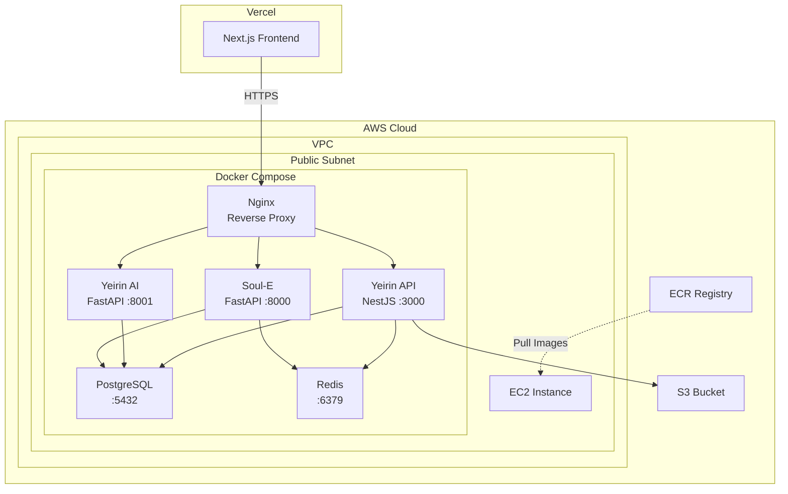

# Yeirin Infrastructure

> Yeirin 백엔드 마이크로서비스 AWS 인프라 관리

## 아키텍처 개요



## 기술 스택

| 구성요소 | 기술 | 용도 |
|---------|------|------|
| **IaC** | Terraform | AWS 리소스 프로비저닝 |
| **컨테이너** | Docker Compose | 서비스 오케스트레이션 |
| **CI/CD** | GitHub Actions | 자동 빌드/배포 |
| **리버스 프록시** | Nginx | SSL, 라우팅, CORS |
| **컴퓨팅** | EC2 (t3.small/medium) | 백엔드 서비스 호스팅 |
| **레지스트리** | ECR | Docker 이미지 저장 |
| **데이터베이스** | PostgreSQL (Docker) | 데이터 저장 |
| **캐시** | Redis (Docker) | 세션, 캐시 |

## 비용 최적화

| 리소스 | Dev 환경 | Prod 환경 | 월 예상 비용 |
|--------|----------|-----------|-------------|
| EC2 | t3.small | t3.medium | $15-30 |
| EBS | 30GB gp3 | 50GB gp3 | $2.4-4 |
| ECR | 공유 | 공유 | ~$1 |
| S3 | - | Terraform State | ~$0.1 |
| **합계** | - | - | **~$20-40/월** |

> ALB($20+) 대신 Nginx, NAT Gateway($32+) 대신 Public Subnet 사용으로 비용 절감

## 빠른 시작

### 사전 요구사항

```bash
# 필수 도구 설치
brew install terraform awscli docker

# AWS CLI 설정
aws configure
```

### 1. Terraform 초기화

```bash
cd terraform/environments/dev

# tfvars 설정
cp terraform.tfvars.example terraform.tfvars
# terraform.tfvars 편집 (SSH 키, IP 등)

# 초기화 및 적용
terraform init
terraform plan
terraform apply
```

### 2. EC2 설정

```bash
# EC2 접속
ssh -i your-key.pem ec2-user@<EC2_PUBLIC_IP>

# 초기 설정 스크립트 실행
sudo bash /tmp/setup-ec2.sh
```

### 3. 서비스 배포

```bash
cd /opt/yeirin/docker

# 환경변수 설정
cp .env.example .env
# .env 편집

# ECR 로그인
../scripts/ecr-login.sh

# 서비스 시작
docker-compose -f docker-compose.yml -f docker-compose.prod.yml up -d
```

## 디렉토리 구조

```
yeirin-infra/
├── terraform/
│   ├── modules/           # 재사용 가능한 모듈
│   │   ├── vpc/          # VPC, Subnet, Internet Gateway
│   │   ├── security-groups/  # 보안 그룹
│   │   ├── ecr/          # ECR 레포지토리
│   │   └── ec2/          # EC2 인스턴스
│   ├── environments/
│   │   ├── dev/          # 개발 환경
│   │   └── prod/         # 프로덕션 환경
│   └── backend.tf        # Terraform 상태 관리
├── docker/
│   ├── docker-compose.yml      # 기본 설정
│   ├── docker-compose.dev.yml  # 개발 오버라이드
│   ├── docker-compose.prod.yml # 프로덕션 오버라이드
│   ├── nginx/                  # Nginx 설정
│   └── .env.example            # 환경변수 템플릿
├── scripts/
│   ├── deploy.sh         # 배포 스크립트
│   ├── rollback.sh       # 롤백 스크립트
│   ├── health-check.sh   # 헬스체크
│   └── setup-ec2.sh      # EC2 초기 설정
├── .github/workflows/
│   ├── deploy-dev.yml    # 개발 배포
│   └── deploy-prod.yml   # 프로덕션 배포
└── docs/
    ├── architecture.md   # 상세 아키텍처
    ├── setup-guide.md    # 설정 가이드
    └── troubleshooting.md # 문제 해결
```

## 주요 명령어

### Terraform

```bash
# 계획 확인
terraform plan

# 적용
terraform apply

# 특정 리소스만 적용
terraform apply -target=module.ec2

# 상태 확인
terraform show
```

### Docker Compose

```bash
# 서비스 시작
docker-compose -f docker-compose.yml -f docker-compose.prod.yml up -d

# 로그 확인
docker-compose logs -f api-gateway

# 서비스 재시작
docker-compose restart api-gateway

# 전체 중지
docker-compose down
```

### 배포

```bash
# 전체 배포
./scripts/deploy.sh prod

# 특정 서비스만 배포
./scripts/deploy.sh prod api-gateway

# 롤백
./scripts/rollback.sh prod

# 헬스체크
./scripts/health-check.sh
```

## GitHub Secrets 설정

| Secret | 설명 |
|--------|------|
| `AWS_ACCESS_KEY_ID` | AWS 액세스 키 |
| `AWS_SECRET_ACCESS_KEY` | AWS 시크릿 키 |
| `AWS_ACCOUNT_ID` | AWS 계정 ID |
| `EC2_HOST_DEV` | 개발 EC2 IP |
| `EC2_HOST_PROD` | 프로덕션 EC2 IP |
| `EC2_SSH_KEY` | EC2 SSH 프라이빗 키 |
| `SLACK_WEBHOOK_URL` | Slack 알림 웹훅 |
| `BACKEND_DOMAIN` | 백엔드 도메인 (예: api.yeirin.com) |

## 서비스 엔드포인트

| 서비스 | 경로 | 설명 |
|--------|------|------|
| Yeirin API | `/api/*` | 메인 API (회원, 기관, 상담) |
| Yeirin AI | `/ai/*` | AI 추천 서비스 |
| Soul-E | `/soul/*` | LLM 심리상담 챗봇 |
| Health | `/health` | Nginx 헬스체크 |

## Vercel 연동

프론트엔드(Next.js)는 Vercel에서 배포됩니다.

### Vercel 환경변수

```bash
NEXT_PUBLIC_API_URL=https://api.yeirin.com
```

### CORS 설정

Nginx에서 다음 도메인 허용:
- `*.vercel.app`
- `*.yeirin.com`
- `localhost:3001` (개발)

## 문서

- [상세 아키텍처](docs/architecture.md)
- [설정 가이드](docs/setup-guide.md)
- [문제 해결](docs/troubleshooting.md)

## 라이선스

Copyright © 2024 Yeirin Social Cooperative. All rights reserved.
