# Yeirin 인프라 아키텍처

## 전체 시스템 아키텍처

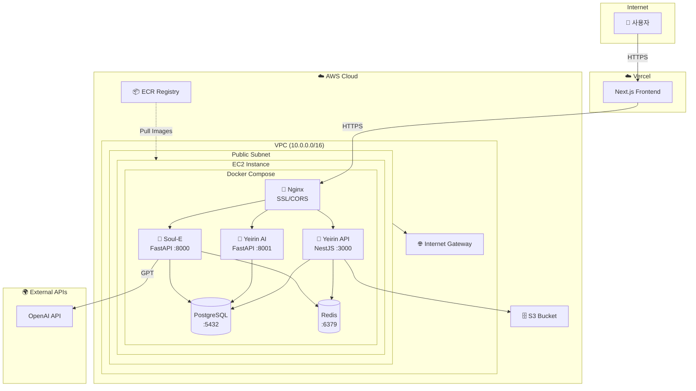

## MSA 서비스 구성

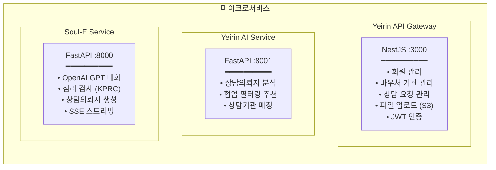

### 서비스별 상세

| 서비스 | 프레임워크 | 포트 | 역할 |
|--------|-----------|------|------|
| **Yeirin API** | NestJS | 3000 | 메인 백엔드 API, 인증/인가 |
| **Yeirin AI** | FastAPI | 8001 | AI 기반 상담기관 추천 |
| **Soul-E** | FastAPI | 8000 | LLM 심리상담 챗봇 |

## 네트워크 아키텍처

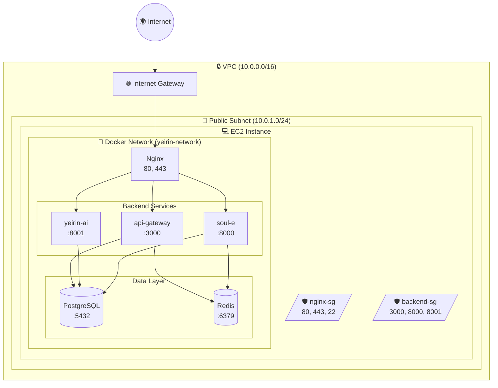

## 보안 그룹 설정

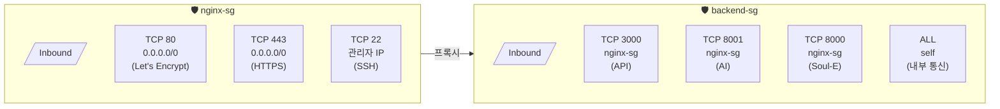

### 보안 그룹 상세

#### Nginx Security Group (nginx-sg)
| 방향 | 프로토콜 | 포트 | 소스 | 설명 |
|------|---------|------|------|------|
| Inbound | TCP | 80 | 0.0.0.0/0 | HTTP (Let's Encrypt) |
| Inbound | TCP | 443 | 0.0.0.0/0 | HTTPS |
| Inbound | TCP | 22 | 관리자 IP | SSH |
| Outbound | ALL | ALL | 0.0.0.0/0 | 모든 아웃바운드 |

#### Backend Security Group (backend-sg)
| 방향 | 프로토콜 | 포트 | 소스 | 설명 |
|------|---------|------|------|------|
| Inbound | TCP | 3000 | nginx-sg | Yeirin API |
| Inbound | TCP | 8001 | nginx-sg | Yeirin AI |
| Inbound | TCP | 8000 | nginx-sg | Soul-E |
| Inbound | ALL | ALL | self | 내부 통신 |
| Outbound | ALL | ALL | 0.0.0.0/0 | 모든 아웃바운드 |

## 데이터 흐름

### 1. 사용자 인증 흐름

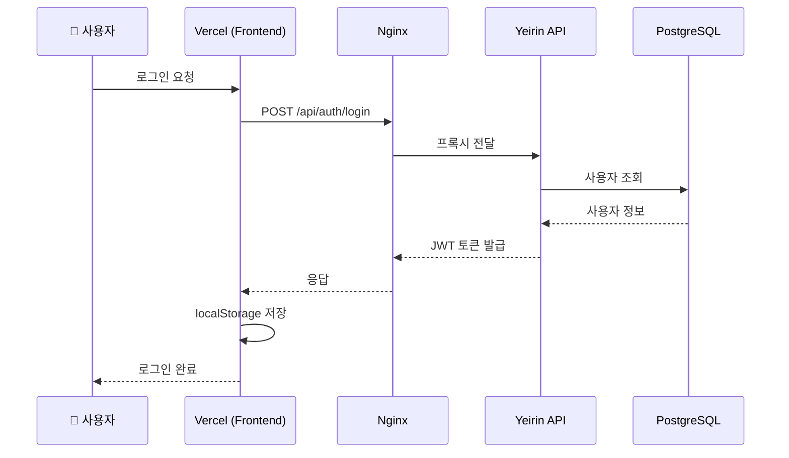

### 2. 심리상담 (Soul-E) 흐름

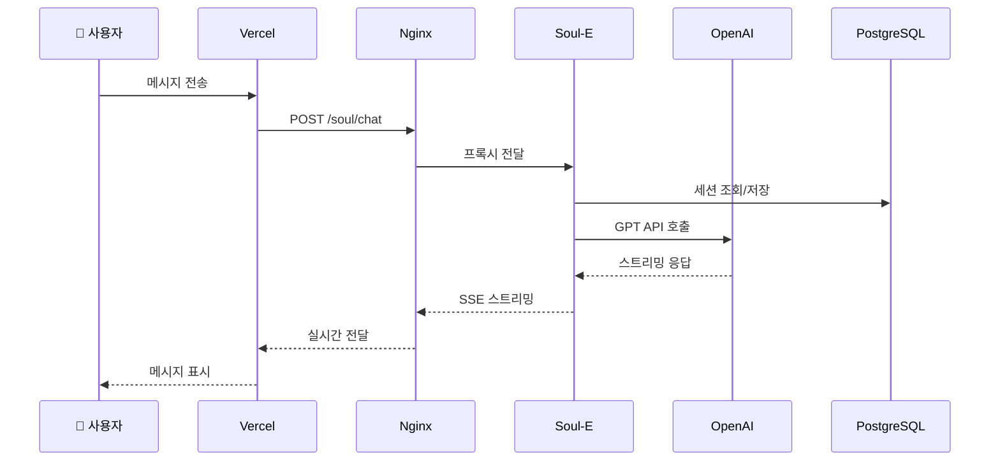

### 3. AI 추천 흐름

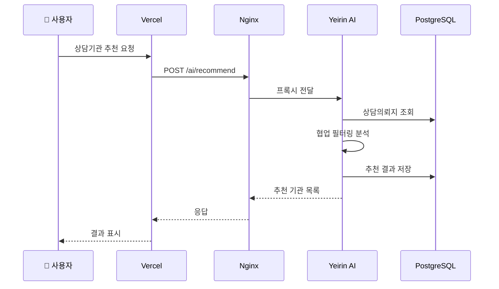

## 배포 아키텍처

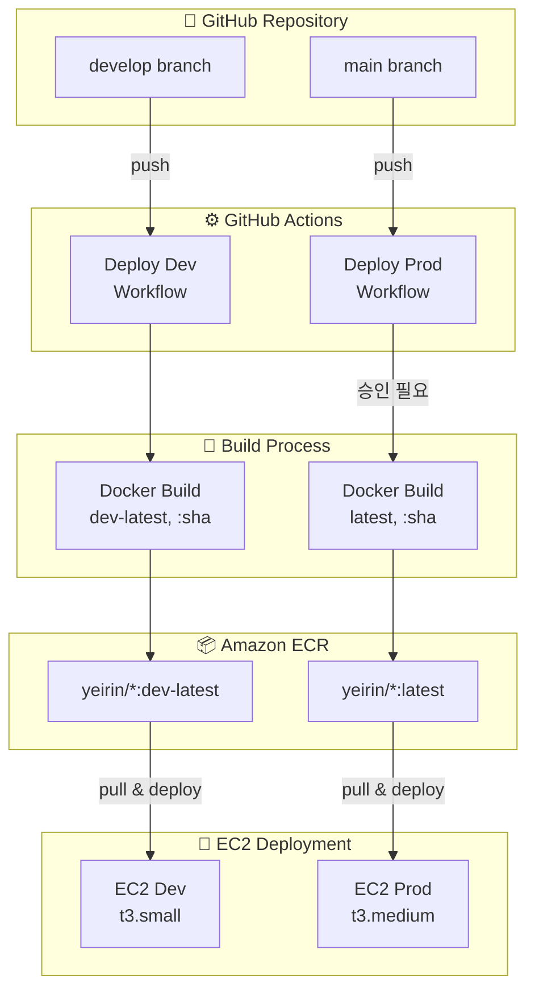

### 배포 프로세스

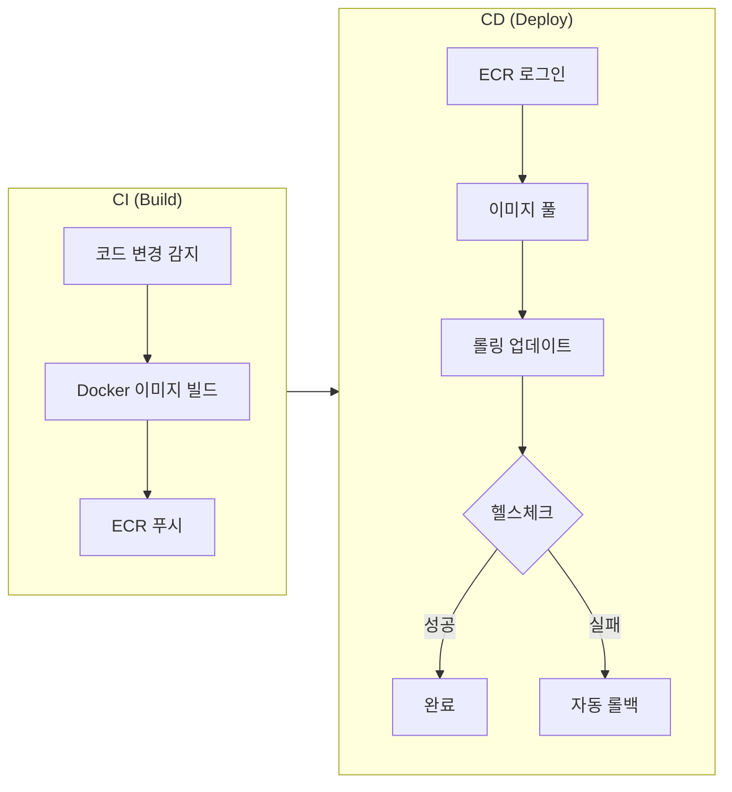

## 확장 전략

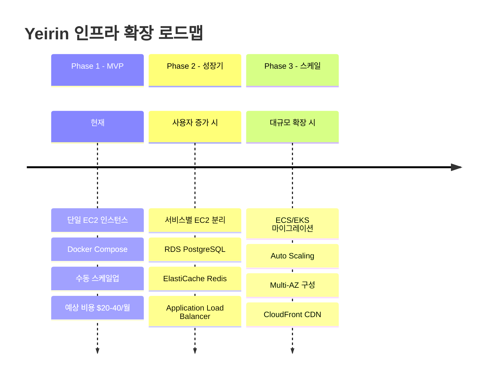

### Phase 상세

| Phase | 상태 | 주요 변경사항 | 예상 비용 |
|-------|------|--------------|----------|
| **Phase 1** | 현재 | 단일 EC2 + Docker Compose | $20-40/월 |
| **Phase 2** | 성장기 | 서비스 분리 + RDS + ALB | $100-200/월 |
| **Phase 3** | 스케일 | ECS/EKS + Auto Scaling | $300+/월 |

## 모니터링

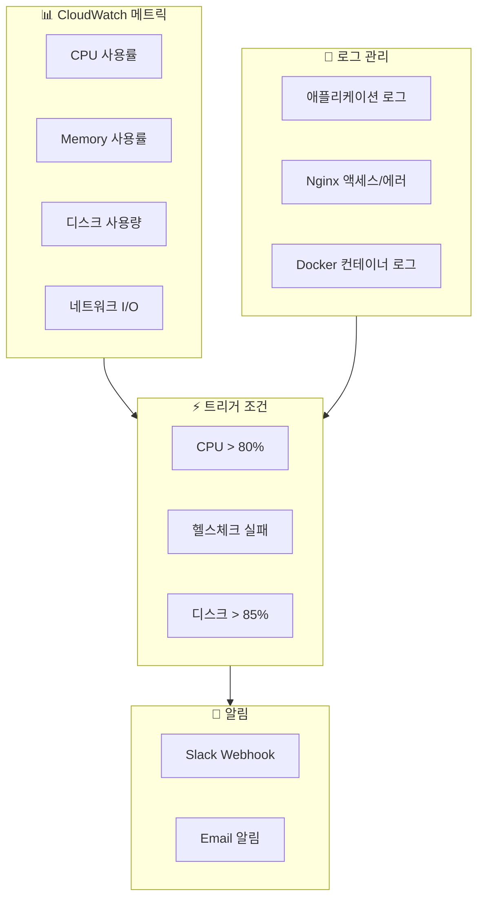

### 모니터링 항목

| 카테고리 | 항목 | 임계치 | 알림 |
|---------|------|--------|------|
| CPU | 사용률 | > 80% | Slack |
| Memory | 사용률 | > 85% | Slack |
| Disk | 사용량 | > 85% | Slack + Email |
| Health | 헬스체크 | 실패 | Slack |
| Nginx | 5xx 에러 | > 10/min | Slack |
